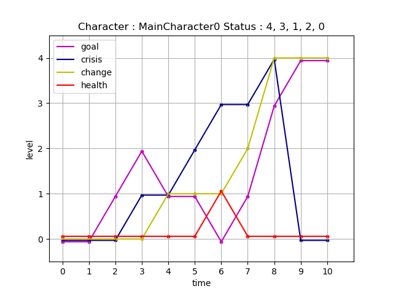
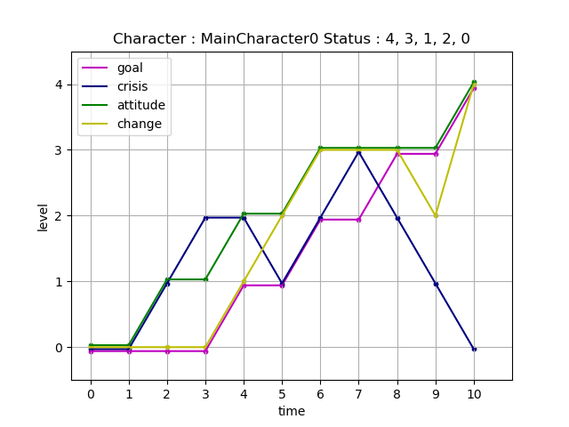
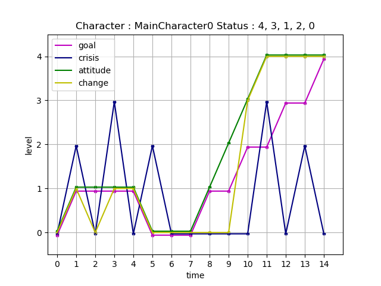
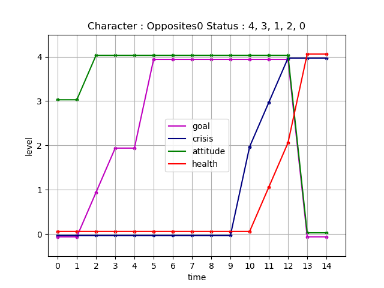

# Porject 122 - Kung Fu Panda 2 - Ellie
## Kung Fu Panda 2 Arcs

## Story Information
### Theme
Bring peace to the world

### Character
#### Hero: Alice, a college student

[Goal, Crisis, Attitude, Change]    
Goal: Save city\
Crisis: Life in danger\
Change: Learn to be a hero\

#### Villain: Martha, a college student

[Goal, Crisis, Attitude, Health]\
Goal: Look after herself no matter cost\
Crisis: People trying to stop her

## Plot
### scene 1 : [0 0 0 0]->[1 2 1 1], [0 0 3 0]->[0 0 3 0]

# Porject 122 - How to Train your Dragon - Eileen
## How to Train your Dragon 2 Arcs

## Story Information
### Theme

### Character
#### Hero: Alice, a college student

Ella, ten years old
 
Goal: find the happiness back

Crisis: Encountered frustration, discouraged and  returned to an unhappy state.

Change: independent, confidence

Atiitude

## Plot
### scene 1 : [0 0 0 0] -> [1 1 0 1]
Since the parents get new jobs in the west coach, Ella moves to the new city with parents from Boston. Everything is not familiar and looks like everything does not go well. Ella soon finds she is not happy anymore. She even does not want to talk to anyone in school.
### Scene 2: [1 1 0 1]->[1 1 1 2]
Ella messes the first quiz up in the new school. It is a big shock to Ella because Ella always is the top student in Boston. Ella blames this to the new city. Ella feels that the new city takes away her happiness. Ella decides to go back to the city where she used to live. Everything will be good if she does. She will be happy again.
 
### Scene 3: [1 1 1 2]->[2 2 2 2]
Ella feels a little bit excited and nervous because this is the first time Ella travels by herself.  She plans to buy the flight ticket first, but she does have not enough money.  She steals her mother's credit card and buys the ticket. 

### Scene 4: [2 2 2 2]->[2 3 2 2]
She feels better after she gets the ticket because she believes her happiness is on the way. Unfortunately, the check-in agency told her, 
 she could not fly by herself because she is under 12, she needs to fly with an adult or the adult sign the waiver form. 

### Scene 5: [2 3 2 2]->[3 3 3 3]
Fail to get on the flight, Ella feels this is the worst day ever.  She still wants to back extremely. Okay, I still have the choice, the bus, whatever transportation,  nothing could stop me to go back. Ella plans to go to the station and her Mom shows up. 

### Scene 6: [3 3 3 3]->[1 3 2 3]
Mom found her credit card lost, in the meanwhile, she got the message from the bank.  She got what had happened right away. She found Ella by the ticket information. She takes Ella back to home without any words. Ella is very upset. She feels she can not find happiness back.。

### Scene 7: [1 3 2 3]->[2 3 4 3]
The second day, Ella goes to school in a bad mood.  After sitting in the classroom, her classmate Monica comes and invites her to take after school activity about Boston. Boston? Really? Ella's feeling is complicated. Take or not? She's hesitant about that. 'It won't be fun without your participation.'  'Okay, I am in.' Ella takes this invitation. 

### Scene 8: [2 3 4 3]->[3 0 4 3]
Ella and Monica go to the activity after school. The decoration is full of Boston style, nothing is special. Ella starts to feel boring and wants to escape. The light of the room is closed suddenly. The projector on the wall shows a familiar face, Ella's close friend in Boston. 'Surprise, Ella! How it possible your sharing experience in Boston does not include me?' Ella's eues are bigger at this moment. ' I miss you so much. Your new classmates asked me to do a video for you. They care about you a lot. I believe your feeling must be so different at this moment.  Ella, don't be sad. Boston always is open for you. We all stand by you. Good luck. ' At this moment, a big smile shows on Ella's face.

### Scene 9: [3 0 4 3]->[4 0 4 4]
The light is turned on. Monica talks with Ella first, 'Ella, how about the Lobster in Boston, I am a super fan about it. ' 'Ella, how about the snow in Boston?' 'Ella, do you like...?' Everyone tries to talk with Ella. Ella looks so busy with a big happy face. 

### Scene 10: [4 0 4 4]->[4 0 4 4]
Camera goes to Ella's backpack. Mom's credit card and Ella's piggy bank still in Ella's backpack.

# Porject 184 - Superman II- Frank
## Superman II Arcs

## Story Information
### Theme
The most important things in the life

### Character
#### Character: Henry, 23 years old young man
Goal: new life\
Conflict : \
Attitude : \
Change : belief

## Plot
### scene 1 : [0 0 0 0]->[0 0 0 0]
Henry has already complained about his life to the bartender every night for a long time. 
Until one day, the bartender gives him an address and tells him, 
if you want to have an different life, you can go to meet this guy. 
### scene 2 : [0 0 0 0]->[0 1 1 0]
Henry followed the address to a mansion in the city, 
and the wallet was snatched on his way, 
leaving only the note with the address in his pocket. 
Henry thinks if he can live in such a place, he can give up everything he has.  
### scene 3 : [0 1 1 0]->[0 2 1 0]
The owner of the mansion tells Henry he has a machine that can make Henry's dream comes true, 
however, everything has a price. Henry will get the life he want, but he need to give up something to exchange.
The price is the 10 years of life. And the price to leave this place without do the exchange is 10 years of life. 
Henry accepts the deal without hesitation. 
### scene 4 : [0 2 1 0]->[1 2 2 1]
Henry choose to become a rich man, then he can buy anything he want. 
Henry become a 33 years old man, the richest man in the town. He has enjoy these days at the beginning.
He can buy anything he want, but nothing with actual price can make him happy anymore later. 
His company partner wants to kick him out of the company and his children only come home to ask for the money.
He think money may not the most important thing, he go back to the mansion and asks for another life exchange.
The owner told him, this time the price would be 15 years.
### scene 5 : [1 2 2 1]->[1 1 2 2]
Henry choose to become the mayor, every one will listen his order.
Henry become a 48 years mayor. Although he has the power to change many thing, he needs to attend to every
meeting and travel around the city. There are also many people Want to drive him off from the mayor. 
Henry is exhausted and frustrated. He is not sure about the power is the thing he want most or not.
### scene 6 : [1 1 2 2]->[2 2 3 3]
During the election, his most trusted men betrayed him. Henry notices the power is not the most important thing.
### scene 7 : [2 2 3 3]->[2 3 3 3]
Although he win the election at the end, his family cut off the connection with him because of the rumors. 
### scene 8 : [2 3 3 3]->[3 2 3 3]
Henry back to the mansion again, and asks for the best life ever, this time the price is 20 years of life.
The price doesn't matter anymore to Henry.
### scene 9 : [3 2 3 3]->[3 1 3 2]
Henry is 68 years old, this time he become a normal person, Henry himself, but he is 68 years old now.
Henry is confused and angry. "Why I become myself? This cost me 20 years of life?"
### scene 10 : [3 1 3 2]->[4 0 4 4]
The memories of his life between the missing 45 years poured into his brain, he remember everything.
He has met his wife at 25, they have 3 lovely children. He believe his family is the best family ever, though he is not rich.
He has build a lot of long-term friends during these years, they share the best time of the life together, though his has no power at all.
...
Henry suddenly understand, the most important things in his life is time(different experience). 
With the time, there are thousands possibilities and great journeys.

Henry opens his eyes, he has been waked up by the bartender.

# Porject 122 - Lion King- Kyle
## Lion King Arcs

## Story Information
### Theme
Bring peace to the world

### Character
#### Hero: Alice, a college student

[Goal, Crisis, Attitude, Change]    
Goal: Save city\
Crisis: Life in danger\
Change: Learn to be a hero\

#### Villain: Martha, a college student

[Goal, Crisis, Attitude, Health]\
Goal: Look after herself no matter cost\
Crisis: People trying to stop her

## Plot
### scene 1 : [0 0 0 0]->[1 2 1 1], [0 0 3 0]->[0 0 3 0]
Alice and Martha are college students and best friends, 
though Martha has always secretly resented Alice for her bigger successes in life. 
One day, while shopping at a thrift store, the two find tattered old spandex costumes. 
They try them on for a laugh and are surprised to find that the costumes give them super-strength and the ability to fly.

### scene 2 : [1 2 1 1]->[1 0 1 0], [0 0 3 0]->[1 0 4 0]
Alice and Martha put the costumes on and stop a bank robbery. 
While Alice is not looking, Martha helps herself to some of the money.
 
### scene 3 : [1 0 1 0]->[1 3 1 1], [1 0 4 0]->[2 0 4 0]

 Back in their dorm, Alice talks about how different things will be now that they have superpowers. 
 Martha asks if they should really be superheroes, 
 or if they should be looking out for themselves instead. Alice thinks that she is joking, 
 but it turns into an argument.

### scene 4 : [1 3 1 1]->[1 0 1 1], [2 0 4 0]->[2 0 4 0]
The two friends fight, with Martha saying that she will always look out for number one. During the clash, Alice’s costume is destroyed and she loses her superpowers. Martha takes off into the night, leaving Alice alone and powerless
### scene 5 : [1 0 1 1]->[0 2 0 0], [2 0 4 0]->[4 0 4 0]
Alice considers her options but realizes there is little she can do without powers. She goes for a walk and is approached by a man with a weapon.

### scene 6 : [0 2 0 0]->[0 0 0 0], [4 0 4 0]->[4 0 4 0]

The man robs Alice. She gives him everything she has, knowing she cannot fight back – it is too dangerous. She realizes that her days of heroism are over and is just grateful to be alive.

### scene 7 :[0 0 0 0]->[0 0 0 0], [4 0 4 0]->[4 0 4 0]

Alice goes back to her life and focuses on school. Marth is constantly in the news for her powers.

### scene 8 : [0 0 0 0]->[1 0 1 0], [4 0 4 0]->[4 0 4 0]

Martha goes on television to announce that she is taking over the planet and expects immediate surrender from everyone. No one can stop her. Alice watches, and knows that she must try.
### scene 9 : [1 0 1 0]->[1 0 2 0], [4 0 4 0]->[4 0 4 0]
Alice goes back to the thrift store. The streets have descended into chaos as people riot, and she is forced to make her way slowly and carefully. Martha continues her plan to take over the world.

### scene 10 : [1 0 2 0]->[2 0 3 3], [4 0 4 0]->[4 2 4 0]
Alice searches the thrift store carefully and finds one more costume just like the other two. She puts it on and has her powers back. She goes out into the city and begins to quell the riots and clam people down. One of Martha’s henchman informs her that a new hero has appeared. She realizes that it has to be Alice.

### scene 11 : [2 0 3 3]->[2 3 4 4], [4 2 4 0]->[4 3 4 1]
Alice continues fixing things in the city. Martha shows up and challenges her, promising to defeat her for good this time.

### scene 12 : [2 3 4 4]->[3 0 4 4], [4 3 4 1]->[4 4 4 2]
The two fight. Alice realizes that Martha is very adamant on seriously wounding or even killing her.

### scene 13 : [3 0 4 4]->[3 2 4 4], [4 4 4 2]->[0 4 0 4]
The people of the city take Alice’s side, including the police. Martha realizes she is losing the battle. Alice tries to convince her to surrender.
### scene 14 : [3 2 4 4]->[4 0 4 4], [0 4 0 4]->[0 4 0 4]
Martha desperately presses her attack, refusing to surrender. She is killed in the struggle, even though Alice tries to saver her. Alice restores peace to the world and becomes her city’s protector.

