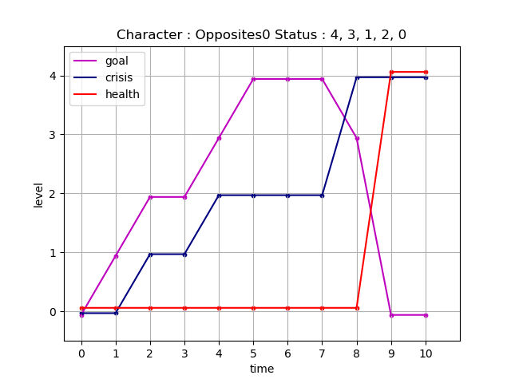
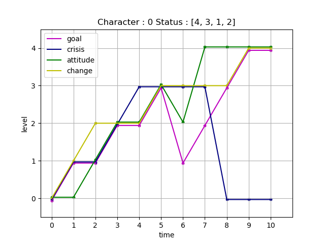

# Porject 122 - Kung Fu Panda 2 - Ellie
## Kung Fu Panda 2 Arcs

## Story Information
### Theme
Bring peace to the world

### Character
#### Hero: 14 year old girl from secluded remote village hidden in Safari on Island
Goal: Protect Land/Animals
Crisis: life/death
Change: Value of Nature

#### Villian: A Poacher/developer
Goal: Kill all the Animals and Build on Land
Crisis: Life/Death

#### Villain: Martha, a college student

[Goal, Crisis, Attitude, Health]\
Goal: Look after herself no matter cost\
Crisis: People trying to stop her

## Plot
### scene 1 : [0 0 0 0]->[0 0 0 0], [0 0 0]->[1 0 0]
Olivia awakens in her tent and goes about her day as normal. She watches as the boy’s get ready to go on a hunt that makes them officially men. Meanwhile, a few miles outside of the village a poacher has landed on their Island. This Poacher is the Famous Bafangulo who’s goal in life is to make as much money as possible by taking over lands, killing all the animals, cutting down all the trees, and building expensive condos

### scene 2 : [0 0 0 0]->[1 0 0 0], [1 0 0]->[2 1 0]

Bafangulo encounters the troop of boy’s and a battle occurs. Bafangulo and his men are able to capture the boy’s and take them as prisoner. A messenger parrot that belongs to the tribe and was with the boy’s manages to escape and fly home. When Olivia hears the message she knows that it is up to her to step up and try and find the boy’s.

### scene 3 : [1 0 0 0]->[2 1 0 0], [2 1 0]->[2 1 0]

Olivia set’s out on her journey complaining about all the bugs, and roots she keeps tripping on. She trips on a root and falls down a steep ravine about 10 ft deep. In this ravine she finds a large glowing rock, which she believes is the stone her grandmother told her about. This stone gives life and protects the island. It also somehow gives Olivia the power to talk to animals. She ties this rock around her neck and decides to take it with her for protection. Meanwhile Bafangulo is still taking the boy’s back to his lair with his minions.

### scene 4 : [2 1 0 0]->[1 1 1 0], [2 1 0]->[3 2 0]

Unfortunately, Olivia get’s lost in a dark part of the forest. But she becomes friends with a wise owl who is able to lead her out. She begins to start reflecting on why she hates nature. Once at his Lair Bafangulo sees his large shipment of Dynamite has arrived. While he is not looking a boy manages to escape.

### scene 5 : [1 1 1 0]->[1 2 1 0], [3 2 0]->[4 2 0]

The boy finds Olivia in the forest and tells her of Bafangulo’s plan to destroy the land. He begs her to run away with him and get to safety. Olivia agrees reluctantly because this is a boy she had a crush on. Unfortunately one of Bafangulo’s minions has followed the boy and starts following them. He calls Bafangulo and notifies him that his one true enemy has retreated. Hearing this news he sends his minions out to catch and capture every animal. He begins using the dynamite to destroy mountains.

### scene 6 : [1 2 1 0]->[0 3 1 1], [4 2 0]->[4 2 0]

The minion decides to attack Olivia and the boy and manages to beat them up and tie them up. He begins taking them to Bafangulo. Bafangulo continues to destroy the land.

### scene 7 : [0 3 1 1]->[1 3 2 0], [4 2 0]->[4 2 0]

While being carried Olivia begins to realize that she made the wrong choice and never should have run away. She begins to hear the cries of all the animals that have been captured and begins to cry. The tears reach the stone she is wearing around her neck and she begins to heal.

### scene 8 : [1 3 2 0]->[3 4 4 0], [4 2 0]->[3 4 0]

Once they arrive at the lair of Bafangulo all the animals are ecstatic to see Olivia. They rally together to untie Olivia. This makes Olivia realize she was wrong hating the animals. She vow’s to save and protect them just like they did to her. Olivia uses the stone to apologize to the animals for hating them. She then asks them to help her defend their land.  The animals agree and begin fighting against Bafangulo and his henchmen.

### scene 9 : [3 4 4 0]->[4 0 4 0], [3 4 0]->[0 4 4]

Bafangulo manages to snatch the stone off of Olivia’s neck during battle. He uses it to try and convince the animals to attack Olivia. They refuse at first but Bafangulo reads the inscription on the stone that gives him full control of the animals. They begin charging at Olivia. Olivia shouts No! and discovers that all the animals can still hear her. This breaks the power Bafangulo had over them. The messenger parrot manages to steal the stone from Bafangulo and bring it back to Olivia. During the fight while there is an avalanche in the cave which causes Bafangulu to fall off the edge of a cliff. While clinging to the edge Olivia runs and offers him her hand. Instead of reaching for her hand he reaches for her stone necklace but misses. His hand slips and he falls to his Death. 

### scene 10 : [4 0 4 0]->[4 0 4 0], [0 4 4]->[0 4 4]

After his death the boy’s are freed and they get to work freeing and taking care of injured animals. Olivia returns home and is crowned Protector of the Realm. The Tribe lives happily and in harmony with all wildlife and nature.

# Porject 122 - How to Train your Dragon - Eileen
## How to Train your Dragon 2 Arcs

## Story Information
### Theme

### Character

Ella, ten years old
 
Goal: find the happiness back

Crisis: Encountered frustration, discouraged and  returned to an unhappy state.

Change: independent, confidence

Atiitude

## Plot
### Scene 1: [0 0 0 0] -> [1 1 0 1]
Ella is introverted and timid. Ella plans to spend her summer with Aunt. She is attracted to her aunt's private library. However, her aunt tells her never touch the book in the glass cabinet, otherwise, it would cause confusion. Ella is very curious about that book. Finally, she takes out the book and reads it when her Aunt out of town. She finds this book is magic book soon. She can enter the book world right away and all the characters are alive when she is reading loudly.

### Scene 2: [1 1 0 1]->[1 1 1 2]
Cinderella, Snow White, Rapunzel, all the characters she loves are lively. She feels fantastic she could meet the characters in person. Ella has a bold idea. She know what will happen to each story,  maybe she can help the main character avoid those troubles in the story.
 
### Scene 3: [1 1 1 2]->[2 2 2 2]
However, things never follow the direction as Ella expected. She broke Cinderella crystal shoe, cut Rapunzel's blond hair by accident, and gave Snow White's apple to the dwarf. After Ella reads more and more, the order in the fairyland becomes worse and worse. Ella's aunt comes back and finds this situation. She tells Ella that the only way to fix this problem is find the author Grimm and ask him to rewrite the story,  the fairyland will be saved. Ella does not believe she is able to find Grimm 
by herself. Auntie encouraged her to move forward bravely, she needs to fix the problems she made by herself. Ella takes the book and starts her journey to Grimm's castle.

### Scene 4: [2 2 2 2]->[2 3 2 2]
Ella comes to a forest by the Aunt's hint. She will see Grimm's castle after she goes through the forest. Ella takes a deep breath and walks into the forest. Ella feels so scared when she hears the horrible sounds from the deep of the forest. She starts to be tremble. She just wants to escape from the forest. She tells herself 'don't do that, don't do that', but the legs does not follow the order, she goes back physically.

### Scene 5: [2 3 2 2]->[3 3 3 3]
The book flies from Ella's backpack suddenly when Ella goes back. The book is opened by itself on the Cinderella page. Cinderella is crying with the broken crystal shoe. Her stepmother is yelling at her, beating her and laughing loudly. Ella changes her mind right away after watching this view. Ella realizes that she messed everything up, this is her responsibility to fix. She feels she is not that scared as before, she takes the map keeps going. The terrible sounds never stop. Ella keeps going, she encourages herself even she still feels a little bit scared. Finally, she comes out of the forest, the Grimm's castle is right in front of her. Unfortunately, Grimm is on an adventure, 

### Scene 6: [3 3 3 3]->[1 3 2 3]
There is no one could figure out where is the Grimm. Ella is despaired. How to save the fairyland without Grimm's rewriting? SHe has no any ideas. Ella feels sad and cries. Then she plans to give up, goes back home tomorrow morning.

### Scene 7: [1 3 2 3]->[2 3 4 3]
At night, Ella lay in the bed and is not able to sleep, her feeling is complicate. She is regretting and after a while, she finds the book is flying and flashing, looks like asking her to follow. Ella follows the book and comes to a room. She falls down to the dark space when she opens the door. After a series of tumbling, she lands in a small room.

### Scene 8: [2 3 4 3]->[3 0 4 3]
There is only one table in the small room. A notebook and a pen on the table. After reading the notebook, Ella starts to know, the book in her Aunt's house is written by Grimm also. The pen on this table is a magic pen that is why she can enter the fairyland when she is reading it. Grimm got it from a witch, his regular fairy tale book was very popular and the witch loved it. He promised to the witch to write something different. He tried to check the magic power and he wrote the same story again. He realized the characters were alive, he felt it was not that good as he expected that maybe something bad would happened. Then he separated the book and the pen. He gave the book to Ella's Aunt and left the pen here. Grimm mentioned that the pen could be used to fix the problems that like Ella made. Rewriting the book as the regular one like Aunt said. Ella is so excited and start to rewrite the book. 

### Scene 9: [3 0 4 3]->[4 0 4 4]
The confusion of the fairyland is fixed by Ella's rewriting. Everything back to the normal. But Ella still feel guilty because there are a lot like Cinderella Ella decides to do something to make up. 

### Scene 10: [4 0 4 4]->[4 0 4 4]
There is one blank page left when Ella finish the writing. She looks at the blank page and has another idea that she draws more crystal shoes, a lot of good looking princes, some no poisoned apples for the future if someone else make the same mistakes as her, they can just take to fix the problems right away without rewriting. When she done everything, she feels tired and falls asleep on the table, the book is opened on the table. Camera turn to the book, the princes Ella draws on that page laugh to themselves maliciously.

# Porject 184 - Superman II- Frank
## Superman II Arcs

## Story Information
### Theme
find the most important things in the life

### Character
#### Character: Henry, 23 years old young man
Goal: new life\
Conflict : \
Attitude : \
Change : belief

## Plot
### scene 1 : [0 0 0 0]->[0 0 0 0]
Henry has already complained about his life to the bartender every night for a long time. Henry always said he life is terrible because he is not rich.
Until one day, the bartender gives him an address and tells him, 
if you want to have an different life, you can go to meet this guy. 
### scene 2 : [0 0 0 0]->[0 1 1 0]
Henry followed the address to a mansion in the city. Although the address is in the city's downtown, weirdly, no one around on the street.
When seeing this building, Henry thinks if he can live in such a place, he can give up everything.  
### scene 3 : [0 1 1 0]->[0 2 1 0]
The owner of the mansion told Henry he could make Henry's dream comes true. The owner told Henry to come back tomorrow, he need some time to prepare the things.
The owner also warned Henry that the transaction is irrevocable. Some thing terrible would happen if he accepted the deal and did not come back. Henry is shocked by the warning, but he accepted the deal. 
### scene 4 : [0 2 1 0]->[1 2 2 1]
The next day, Henry came back and he met another man in the mansion. The owner told Henry that this man is a millionaire and the machine will switch their souls, Henry then can have the life he want.
Henry has never heard anything like this, he is scared and want to leave but the man in black takes him into the machine.
### scene 5 : [1 2 2 1]->[1 1 2 2]
Henry become the millionaire, he enjoys the first few year of his new life. However, few years later, he the thing with actual price can't make him happy anymore. 
He starts to get more and more irritable and he doesn't know what he can do. What he once wanted most couldn't bring him happiness anymore.
### scene 6 : [1 1 2 2]->[2 2 3 3] 
One day one the street, he sees 'Henry'(his body before the soul exchange) at the other side of the street. 
Although "Henry" still looks poor, "Henry" has a smile he has never seen before, and he knows that this was happiness.
He is very curious about 'Henry's' current life, because there is only bad thing in his old memories, What has happened to 'Henry' in recent years.
### scene 7 : [2 2 3 3]->[2 3 3 3]
Henry walks across the street and tries to talk to 'Henry'. 
Suddenly he can not move anymore, he sound of the mansion owner's voice suddenly appeared in his ear and tells him 'you cannot interfere 'Henry's' life, you already make the deal.'
### scene 8 : [2 3 3 3]->[3 2 3 3]
Henry pays someone to investigate 'Henry' life, he believes there is something happen in 'Henry' life. 
However, the 'Henry' life in the report are not much different from what Henry remember, the only different is 'Henry' work harder and more optimistic than Henry.
Henry doesn't believe this and want to see it by himself, but the mansion owner's whisper has appeared again. 
### scene 9 : [3 2 3 3]->[3 1 3 2]
For the following of days, Henry couldn't stop thinking about it, he wants to figure out what has happened. Henry go to see the mansion owner again.
The mansion owner tells him, everything is the same. The different is 'Henry' has a dream but Henry doesn't. 
The Henry can't believe that, because he has a dream when he is 'Henry' and that dream is become a rich man. 
He has already achieved his 'dream' and why he is not happy at all. ' 'Henry' can not be happier than me, this is all illusion', he shout at the mansion owner.
### scene 10 : [3 1 3 2]->[4 0 4 4]
The mansion owner tells Henry, you can talk to 'Henry' just before the end of your life and he will have the answer.
Many years later, 'Henry' comes to Henry house and 'Henry' is already a millionaire now. 'Today is your last day, and the mansion owner asks me to come to see you.'
After so many years, 'Henry' becomes as rich as him and get the things he already has for a long time. Henry already knows the money is not the key but what is the key then. 
'It's the journey of chasing your dreams, the pain and happiness in this process is the real wealth. 
Become a rich man is a dream, but you never try to achieve that by pass through the process, thus you can not feel the pleasures'. 
'Henry' passes his memory to Henry and Henry finally knows everything, but there is no chance for him to live as young Henry again. 

Henry opens his eyes, he has been waked up by the bartender.

# Porject 122 - Lion King- Kyle
## Lion King Arcs

## Story Information
### Theme
Bring peace to the world

### Character
#### Hero: Alice, a college student

[Goal, Crisis, Attitude, Change]    
Goal: Save city\
Crisis: Life in danger\
Change: Learn to be a hero\

#### Villain: Martha, a college student

[Goal, Crisis, Attitude, Health]\
Goal: Look after herself no matter cost\
Crisis: People trying to stop her

## Plot
### scene 1 : [0 0 0 0]->[1 2 1 1], [0 0 3 0]->[0 0 3 0]
Alice and Martha are college students and best friends, 
though Martha has always secretly resented Alice for her bigger successes in life. 
One day, while shopping at a thrift store, the two find tattered old spandex costumes. 
They try them on for a laugh and are surprised to find that the costumes give them super-strength and the ability to fly.

### scene 2 : [1 2 1 1]->[1 0 1 0], [0 0 3 0]->[1 0 4 0]
Alice and Martha put the costumes on and stop a bank robbery. 
While Alice is not looking, Martha helps herself to some of the money.
 
### scene 3 : [1 0 1 0]->[1 3 1 1], [1 0 4 0]->[2 0 4 0]

 Back in their dorm, Alice talks about how different things will be now that they have superpowers. 
 Martha asks if they should really be superheroes, 
 or if they should be looking out for themselves instead. Alice thinks that she is joking, 
 but it turns into an argument.

### scene 4 : [1 3 1 1]->[1 0 1 1], [2 0 4 0]->[2 0 4 0]
The two friends fight, with Martha saying that she will always look out for number one. During the clash, Alice’s costume is destroyed and she loses her superpowers. Martha takes off into the night, leaving Alice alone and powerless
### scene 5 : [1 0 1 1]->[0 2 0 0], [2 0 4 0]->[4 0 4 0]
Alice considers her options but realizes there is little she can do without powers. She goes for a walk and is approached by a man with a weapon.

### scene 6 : [0 2 0 0]->[0 0 0 0], [4 0 4 0]->[4 0 4 0]

The man robs Alice. She gives him everything she has, knowing she cannot fight back – it is too dangerous. She realizes that her days of heroism are over and is just grateful to be alive.

### scene 7 :[0 0 0 0]->[0 0 0 0], [4 0 4 0]->[4 0 4 0]

Alice goes back to her life and focuses on school. Marth is constantly in the news for her powers.

### scene 8 : [0 0 0 0]->[1 0 1 0], [4 0 4 0]->[4 0 4 0]

Martha goes on television to announce that she is taking over the planet and expects immediate surrender from everyone. No one can stop her. Alice watches, and knows that she must try.
### scene 9 : [1 0 1 0]->[1 0 2 0], [4 0 4 0]->[4 0 4 0]
Alice goes back to the thrift store. The streets have descended into chaos as people riot, and she is forced to make her way slowly and carefully. Martha continues her plan to take over the world.

### scene 10 : [1 0 2 0]->[2 0 3 3], [4 0 4 0]->[4 2 4 0]
Alice searches the thrift store carefully and finds one more costume just like the other two. She puts it on and has her powers back. She goes out into the city and begins to quell the riots and clam people down. One of Martha’s henchman informs her that a new hero has appeared. She realizes that it has to be Alice.

### scene 11 : [2 0 3 3]->[2 3 4 4], [4 2 4 0]->[4 3 4 1]
Alice continues fixing things in the city. Martha shows up and challenges her, promising to defeat her for good this time.

### scene 12 : [2 3 4 4]->[3 0 4 4], [4 3 4 1]->[4 4 4 2]
The two fight. Alice realizes that Martha is very adamant on seriously wounding or even killing her.

### scene 13 : [3 0 4 4]->[3 2 4 4], [4 4 4 2]->[0 4 0 4]
The people of the city take Alice’s side, including the police. Martha realizes she is losing the battle. Alice tries to convince her to surrender.
### scene 14 : [3 2 4 4]->[4 0 4 4], [0 4 0 4]->[0 4 0 4]
Martha desperately presses her attack, refusing to surrender. She is killed in the struggle, even though Alice tries to saver her. Alice restores peace to the world and becomes her city’s protector.

